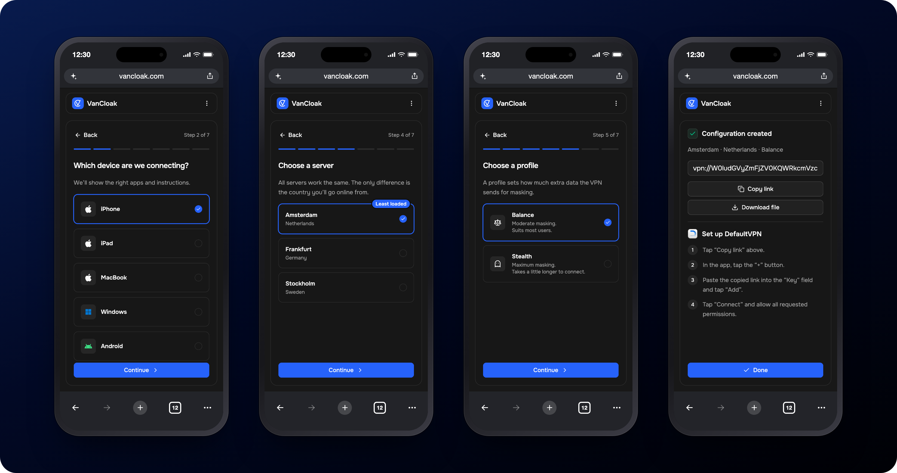
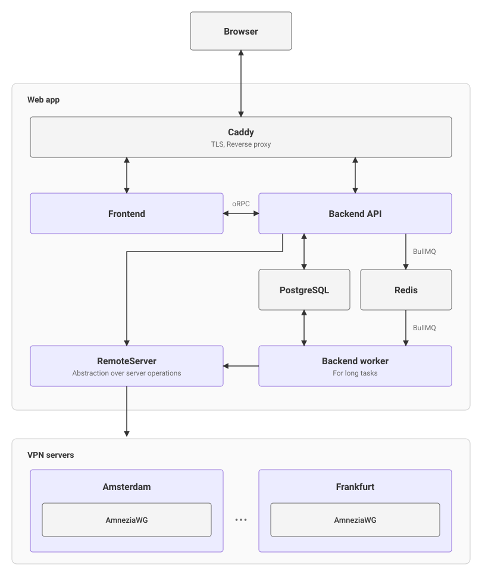
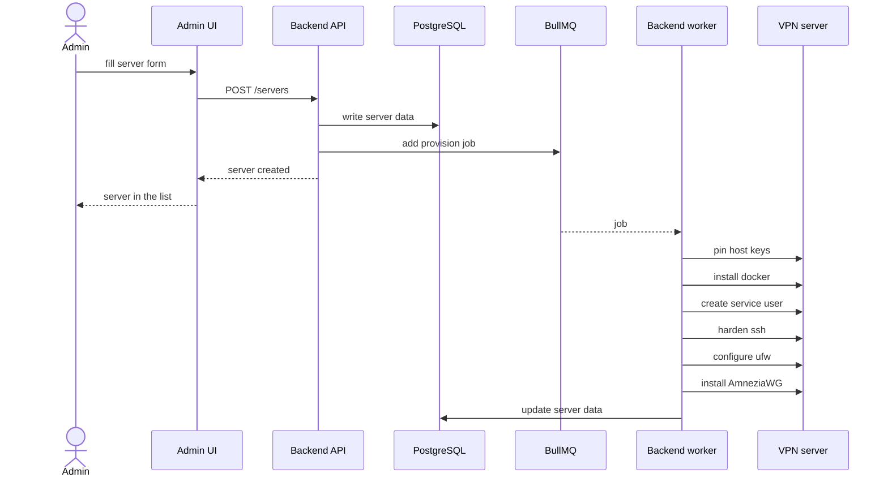
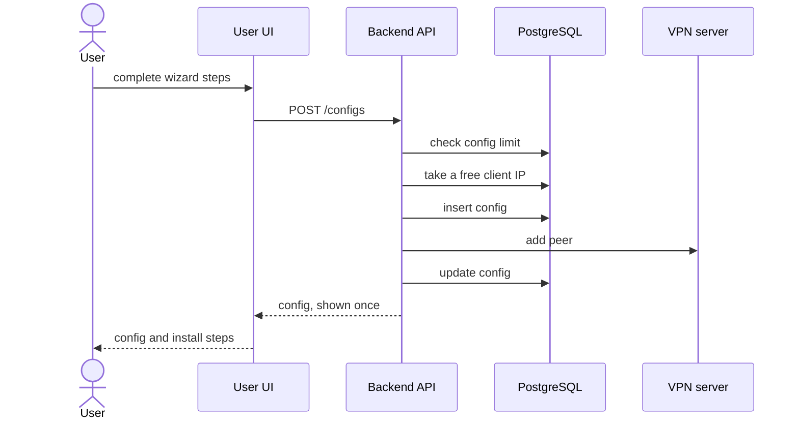

# VanCloak

A web app for managing your own AmneziaWG VPN servers and sharing access with invited users.

The goal is to let you set up and run VPN servers in a couple of clicks, with security best practices and monitoring applied for you, while the people you invite set up their access themselves.

## User interface

Any invited user should be able to set up VPN access on their own. A step-by-step wizard covers every stage of the setup.

Try it yourself at [vancloak.com](https://vancloak.com) — press **Try the demo** on the sign-in page.

## Features

**Admin**

- Automated VPN server setup with AmneziaWG 3.1 and security hardening
- User creation with per-protocol config limits
- User deletion with config removal from the VPN servers
- VPN config creation with fine-grained obfuscation settings

**User**

- Passwordless sign-in by email link
- Config creation and deletion within the limits set by the admin
- Config creation wizard:
  - Setup instructions for each platform
  - Server selection from the available list
  - Obfuscation preset selection

## Roadmap

- Simpler and clearer VPN setup for users
- Monitoring for the web app and the VPN servers
- Full VPN server lifecycle in the admin UI

## How it works

### System overview

What the system is made of and how the parts are wired.

<picture>
  <source media="(prefers-color-scheme: dark)" srcset="docs/images/architecture-dark.svg" />
  
</picture>

### Adding a VPN server

The admin submits the server form and a background job sets up the VPN server. Every step is idempotent, so a failed run is retried by running it again.

### Creating a config

The user walks through the wizard and gets a ready config with instructions for their device. Every creation is atomic, so parallel requests never take the same client IP and a failed VPN server call leaves nothing behind.

## Requirements

**Web app**

- Ubuntu 24.04
- Docker
- Domain pointing at the server
- SMTP credentials for sending emails from that domain

**VPN server**

- Ubuntu 24.04, fresh install
- Root access over SSH by password

## Built on

- [Any Tech ARCHITECT](https://github.com/Vadim-Khristenko/Any-Tech-ARCHITECT) — Obfuscation generator for AmneziaWG
- [devsec.hardening](https://github.com/dev-sec/ansible-collection-hardening) — Battle tested hardening for Linux, SSH, nginx, MySQL
- [amneziawg-go](https://github.com/amnezia-vpn/amneziawg-go) — AmneziaWG server

## Tech Stack

**Frontend**

- Nuxt 4
- TypeScript 5.9
- Tailwind CSS 4
- shadcn-vue
- i18n

**Contracts**

- oRPC 1.14
- Zod 4

**Backend**

- Node.js 22
- Hono 4
- TypeScript 5.9
- better-auth 1.6
- Drizzle ORM 0.45
- BullMQ 5

**Storage**

- PostgreSQL 16
- Redis 7

**Infrastructure**

- Docker
- Caddy 2
- Ansible
- Shell

## License

[AGPL-3.0](LICENSE)
